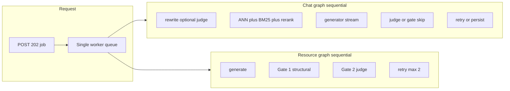

# Latency, quality tradeoffs, and failures

**Branch:** `thevindu-feature` only. Do not merge this to `main` as a substitute for the Tier 3 BM25 / model eval notes in [PLAN.md](PLAN.md).  
**Does not promote** `legal-1.5b` / `qwen25-lora-20260815-090709`. That adapter stays `experimental: true`.

The seven feature adders are already on this branch. They are additive, but several of them spend more wall-clock or create new fail modes. This document maps where time actually goes, why “just update X” fails, which quality–latency levers are safe, and which additions are worth doing.

Phase 2 of this work (same branch) makes the map measurable: stage timings on jobs, a cached BM25 index, structured `error_code`s, an optional job timeout, and resource persist of the best-scoring attempt.

---

## 1. Bottleneck map

Every slow call is a **202 job**. One in-process worker runs them. `llama_cpp.Llama` holds a mutable context, so a thread pool would interleave tokens rather than go faster. Chat, ingest, and resource jobs therefore queue behind each other.

### Chat turn (local GGUFs, CPU)

| Stage | Typical cost | Notes |
|-------|----------------|-------|
| Rewrite | 0 or a small judge call | Heuristic `_needs_rewrite` skips most standalone questions. Follow-ups call the **judge** LLM (`max_tokens=100`). |
| Retrieve | tens–hundreds of ms | Embed query, ANN, optional BM25 merge, cross-encoder rerank (~100 ms / 20 pairs once loaded). |
| Generate | seconds to tens of seconds | Streamed; first tokens ~2 s after a warm GGUF. `max_tokens=320`. |
| Judge | **~25–36 s** | Dominant cost in **pdf** mode. **Skipped** in `general` mode (`LEARNMATE_JUDGE_GATE_MODES=general`). |
| Retry | up to another generate + judge | `MAX_ATTEMPTS=2`. Chat skips retry when there is no critique, or `score < threshold - 25`. |
| Persist | Mongo writes | Chat keeps the **best-scoring** attempt, not necessarily the last. |

Documented wall-clock: **30–60 s per pdf turn** on the local backend.

### Resource (passage)

Gate 1 (structural) is microseconds and runs first. Gate 2 is the same ~25 s judge. Easy-MCQ distractor text and structured-summary rubric lines make the judge prompt slightly longer and can raise reject rate → a second generate + judge.

### Whole-document MCQ / keypoints / practice

Groups run **one after another**. Each group pays generate + Gate 1 + Gate 2 + optional retry. Minutes, not seconds. Document **summary** is cheaper on the judge: per-page folds with `evaluate=False`, one judged pass at the end.

### Ingest

Extract, chunk, embed, BM25 sidecar write. First process after boot also pays ~16 s of embedding-model + import warm-up unless `API_WARM_UP=1` (default on).

### Model switch (`model_id`)

Unload previous **generator** GGUF, load the next. Several seconds, reported on `progress.message`. The judge stays loaded. Two generators in RAM at once is **rejected**.

### Export (docx / pptx)

Not a bottleneck. `GET /api/resources/{id}/export` reads stored content and formats it. No generate, no judge.

### Frontend

`waitForJob` polls 300 ms while streaming, then 1500 ms. **No client timeout** (whole-document runs are allowed to take minutes). A 401 on any API call clears the session and hard-redirects to `/login`, which immediately sends Keycloak `login()` — that is the “localhost buffers and checks again” loop when the backend is down or restarting.

---

## 2. Measured vs estimated

Until Phase 2 timers land on the job record, numbers above are from code comments and the ML eval log, not from live `thevindu-feature` jobs.

**Already measured (offline ML track, Colab T4, not this server):**

- LoRA candidate p95 **16.4 s / 14.9 s** vs **≤ 8 s** bar (`acceptance_thresholds.yaml`). That hardware is **not** production serving; do not treat it as the live GGUF p95.

**Estimated from comments / config (live path):**

- Judge ~25 s (resources) / median ~36 s (chat pdf).
- Boot embedding warm-up ~16 s.
- Rerank ~100 ms / 20 pairs.
- Chat turn 30–60 s.

**What Phase 2 timers prove:** `rewrite_ms`, `retrieve_ms`, `generate_ms`, `judge_ms`, `model_load_ms` on the chat (and passage-resource) job result, plus one INFO log line per turn. Use those before claiming BM25 or a model switch “made it slower.”

---

## 3. Why updates fail

Three failure classes. Mixing them produces the wrong fix (lowering an accuracy bar, or adding retries, or making the failed LoRA the default).

### 3.1 ML track update failed

Candidate `qwen25-lora-20260815-090709` on `lm-legal-v0.1` failed [acceptance_thresholds.yaml](../../model-Thevindu/03_testing_and_versioning/acceptance_thresholds.yaml). Authoritative numbers are in [model_card.md](../../model-Thevindu/04_docs/model_card.md) and `version_registry.csv`.

| Gate | `test` | `test_strict` | Threshold | Result |
|------|--------|---------------|-----------|--------|
| Accuracy (LLM-judge) | 0.557 | 0.621 | ≥ 0.70 | **FAIL** |
| Groundedness | 0.877 | 0.921 | ≥ 0.85 | pass (after `validate_pairs.py`) |
| Hallucination | 0.123 | 0.079 | ≤ 0.15 | pass |
| Latency p95 | 16368 ms | 14879 ms | ≤ 8000 ms | **FAIL** on eval hardware |
| Beat API fallback | 0.557 vs 0.871 | 0.621 vs 0.918 | slack 0.05 | **FAIL** |

The first groundedness fail was an **eval bug** (naive regex over-flagged hallucinations). Rescoring is not a model win.

Making this the silent generator default would fail the live product the same way: weaker general answers, extra unload/reload if anyone switches back, and a false “we improved the model” story. It stays `experimental: true` in `learnmate/models_registry.yaml`. A second training run will not beat `gpt-4o-mini` / Gemini on this corpus size; keep an API backend as the high-quality option.

### 3.2 Feature-adder updates that look like quality wins

- **Stricter Gate 2** (easy MCQ distractors, structured summary rubric) → more rejects → second generate + second judge (~2× 25 s). Do **not** raise `MAX_ATTEMPTS`. The 3B judge oscillates rather than converges.
- **Hybrid BM25** without inspecting `retrieval_mix.rerank_kept` → cannot tell if BM25-only chunks ever survive the reranker. Shipping it as “better retrieve” without that note is the failure [CHANGELOG.md](CHANGELOG.md) already warns about. Rebuild-every-turn of `BM25Okapi` from raw strings was also wasted work (and treated documents as character lists). Phase 2 caches a word-tokenised index per `doc_id`.
- **Switching `model_id` every request** → multi-second unload/reload. Two concurrent generators are unsafe (mutable llama.cpp context).
- **Skipping Gate 1** to “go faster” → the judge spends 25 s on malformed JSON. Gate 1 is the cheap filter; keep it.
- **Raising retries / parallel llama.cpp threads** → known-wrong answers or interleaved tokens, not speed.

### 3.3 Runtime failures the new system handled poorly (before Phase 2)

- Worker stored one error string. The UI could not tell Mongo down vs bad `model_id` vs timeout vs restart.
- Empty chat reply on llama.cpp error still walked evaluate/retry.
- `--reload` watching `venv` restarts the process; Keycloak `check-sso` then looks like a hang.
- Client `waitForJob` had no timeout. Optional `LEARNMATE_JOB_TIMEOUT_S` (default **0 = off**) fails the job between stages so whole-document runs stay legal unless you set it.

---

## 4. Quality vs latency tradeoffs

Levers ranked by **time saved vs quality risk**. Defaults on this branch stay as they are unless a flag is set.

**Already correct — do not reverse**

- Skip the judge in `general` mode (`LEARNMATE_JUDGE_GATE_MODES`).
- `reply_ready`: the student can read while the judge runs.
- Document-summary judges only the final fold.
- Gate 1 in front of Gate 2.
- Chat persist of the **best** attempt (resources did not, until Phase 2).
- One worker / one generator GGUF.

**Opt-in, high savings**

- `LEARNMATE_GENERATOR_BACKEND=gemini` (and/or judge): seconds instead of ~30 s; text leaves the machine. Keep local GGUF as default.
- `API_WARM_MODELS=1` on a demo box: first question is faster; `--reload` becomes painful.
- GPU / Metal: `LEARNMATE_N_GPU_LAYERS=-1` and a CUDA/Vulkan/Metal build of llama-cpp-python. Comments cite ~40 s vs ~6 s depending on the machine.

**Opt-in, medium savings**

- `evaluate=False` for drafts.
- Skip rewrite LLM entirely (follow-ups retrieve worse).
- Narrower `LEARNMATE_JUDGE_GATE_MODES` (quality risk on pdf).
- `LEARNMATE_HYBRID_BM25=0` if mix logs show BM25-only chunks never kept.

**Unsafe “speed”**

- Raise `MAX_ATTEMPTS`.
- Skip Gate 1.
- Make the experimental LoRA the default.
- Two generator contexts / a worker pool over llama.cpp.

---

## 5. Failure handling — as-is vs gaps

| Layer | As-is | Gap / Phase 2 |
|-------|--------|----------------|
| Jobs | `queued → running → done/failed`; stale jobs failed on restart | `error_code`: `storage`, `model`, `parse`, `timeout`, `interrupted`, `unknown` |
| Timeout | none | `LEARNMATE_JOB_TIMEOUT_S=0` off; when set, raise between graph nodes (cannot abort a llama.cpp call mid-token) |
| Gate 1 | fail fast, critique for retry | keep |
| Gate 2 | fail closed on unparseable verdict (score 1) | keep |
| Chat retry | skip if no critique or score far below threshold | keep |
| Chat generate exception | empty reply, graph continues | still recoverable via retry; job-level `model` if it raises out |
| Storage | 503 `StorageUnavailable` / `QdrantUnavailable` | mapped to `error_code=storage` on jobs |
| Rerank / BM25 miss | fall back to vector order / ANN-only | keep |
| Frontend 401 | wipe token, `/login` | start the venv server on 8010; do not use `--reload` against `venv` |
| Frontend job fail | generic `Error` message | `errorMessage` branches on `error_code` |

---

## 6. Additions worth doing

### Done in Phase 2 (this change set)

1. **Stage timings** on chat and passage-resource jobs (`rewrite_ms`, `retrieve_ms`, `generate_ms`, `judge_ms`, `model_load_ms`).
2. **Cache `BM25Okapi` per `doc_id`**, word-tokenised, invalidate on ingest. `LEARNMATE_HYBRID_BM25=0` still disables hybrid.
3. **Structured job failures** (`error` stays human-readable; `error_code` for the UI).
4. **Optional job timeout** (`LEARNMATE_JOB_TIMEOUT_S`, default 0).
5. **Resources persist the best-scoring attempt**, same policy as chat. Trail of all attempts is kept.

### Ranked, not in this change set

| Rank | Addition | Why wait |
|------|----------|----------|
| 1 | Inspect `retrieval_mix.rerank_kept` on real chat turns | Tier 3 gate before `main`; needs traffic, not more code |
| 2 | Gemini / HTTP backend as a documented “fast demo” profile | Env-only; do not flip the default |
| 3 | GPU llama-cpp-python wheel | Machine-specific; `.env` already has the knobs |
| 4 | Fairer job queue (ingest vs chat) | Needs a real broker or leases; one-process assumption |
| 5 | Parallel whole-document groups | Unsafe with one llama.cpp context |
| 6 | Keycloak silent-SSO UX | Separate from generation latency |

---

## 7. What we will not do

- Promote `qwen25-lora-20260815-090709` / `legal-1.5b` to `selectable_default`.
- Load two generator GGUFs at once.
- Raise `MAX_ATTEMPTS`.
- Reverse narrative-summary or MCQ-medium defaults.
- Merge this branch to `main` until BM25 mix eval and any new default model pass the same discipline as the ML track.
- Commit adapters, `.env`, or `venv`.
